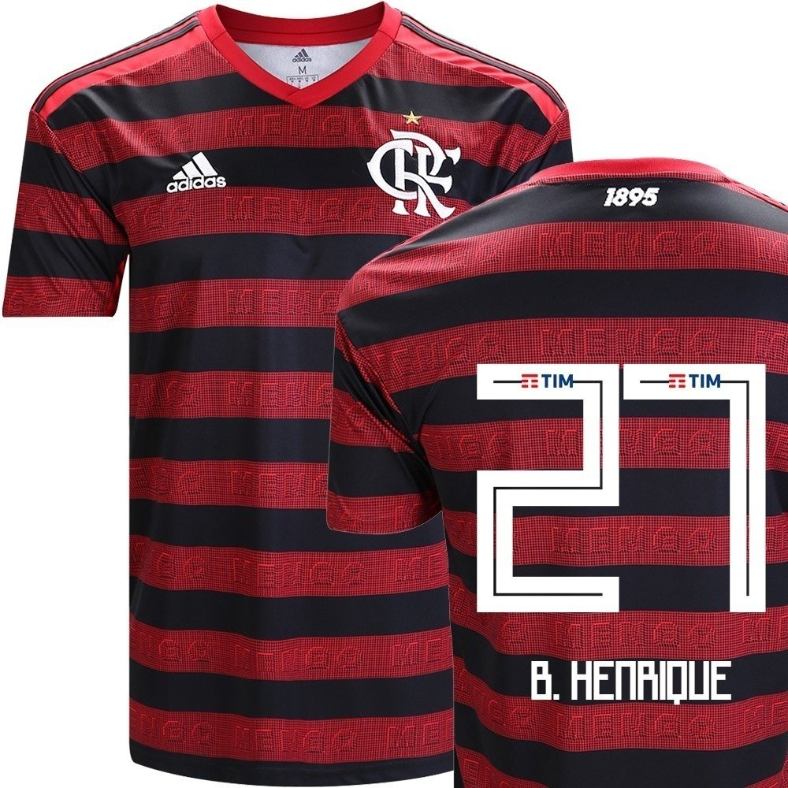

<!doctype html>
<html lang="Pt">
  <head>
    <!-- Required meta tags -->
    <meta charset="utf-8">
    <meta name="viewport" content="width=device-width, initial-scale=1, shrink-to-fit=no">

    <!-- Bootstrap CSS -->
    <link rel="stylesheet" href="https://cdn.jsdelivr.net/npm/bootstrap@4.6.0/dist/css/bootstrap.min.css" integrity="sha384-B0vP5xmATw1+K9KRQjQERJvTumQW0nPEzvF6L/Z6nronJ3oUOFUFpCjEUQouq2+l" crossorigin="anonymous">
    
    <title>FORMULARIO</title>
  </head>
  <body>
      <!-- JUMBOTRON -->
      <!-- ESTE COMPONENTE CRIA UMA ÁREA DE DESTAQUE NA PÁGINA -->
    

       

                <h1 class="display-4">Ótima escolha</h1>
                
Obrigado por comprar na Fashion Roupas, Preencha o formulario abaixo para concluir sua compra.

       

    

    

        

            

                

                    
                    

                      <h5 class="card-title">Camisa 1 CR Flamengo</h5>
                      
Camisa 1 do Flamengo, numero e nome do Bruno Henrique, rei da america

                        <dl>
                            <dt>Produto</dt>
                            <dd>Camiseta</dd>

                            <dt>Cor</dt>
                            <dd>Preta/Vermelha</dd>

                            <dt>Tamanho</dt>
                            <dd>G</dd>
                        </dl>
                    

                

            

            
 
                <form method="POST" action = "checkout.html">

                    <fieldset>
                        <legend>Dados Pessoais</legend>

                        

                            <label for="nome"> Nome Completo </label>
                            <input type="text" name="nome" class="form-control" id="nome" required>
                        

                        

                            <label for="email"> E-mail </label>
                            <input type="email" name="email" class="form-control" id="email" placeholder="email@exemplo.com" required> 

                        

                        

                            <label for="cpf"> CPF </label>
                            <input type="text" name="cpf" class="form-control" id="cpf" placeholder="000.000.000-00" pattern="\d{3}\.\d{3}\.\d{3}-\d{2}"> 
                        

                        

                            <input type="checkbox" name="news" id="news" class="custom-control-input"> 
                            <label for="news" class="custom-control-label"> Quero Receber Newsletter </label>
                        

                    </fieldset>

                    <fieldset>
                        <legend>Cartão de Crédito</legend>
                        

                            <label for="numero">Numero - CVV</label>
                            <input type="text" name="nrcartao" id="nrcartao" class="form-control">
                        

                        

                            <label for="bandeira">Bandeira</label>
                            <select id="bandeira" class="custom-select">
                                <option disabled selected >Selecione uma opção...</option>
                                <option value="master">MasterCard</option>
                                <option value="visa">Visa</option>
                                <option value="express">American Express</option>
                            </select>
                             
                        

                        

                            <label for="validade">Validade</label>
                            <input type="month" name="validade" id="validade" class="form-control">
                        

                    </fieldset>

                    <button  type="submit" class="btn btn-primary btn-lg">Confirmar Pedido</button>
                            
                    
                </form>
        

    

    <!-- Optional JavaScript; choose one of the two! -->

    <!-- Option 1: jQuery and Bootstrap Bundle (includes Popper) -->
    
    

    <!-- Option 2: Separate Popper and Bootstrap JS -->
    <!--
    
    
    
    -->
  </body>
</html>
